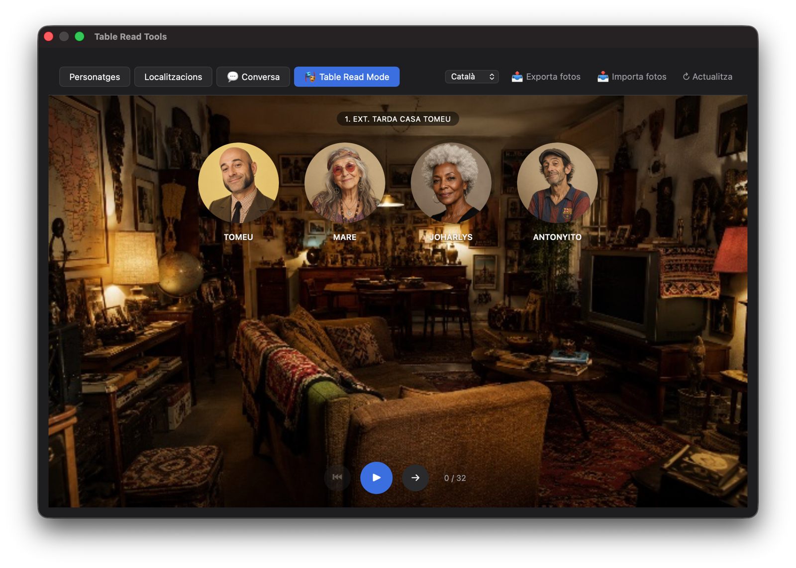

# Table Read Tools — a plugin for Beat

*[Llegeix això en català](README.ca.md)*

**Table Read Tools** is a custom plugin for [Beat](https://www.beat-app.fi), the macOS Fountain screenwriting app. It adds photos to characters and locations, and turns your dialogue into either a chat-style conversation view or a live "table read" playback mode.

**Version 1.0.0** · [Project website](https://emprenyat.cat/scripts/TableReadTools/) · [Changelog](CHANGELOG.md)



Beat itself has no built-in support for character/location photos or for visualising dialogue as a conversation — this plugin adds all of that on top, without modifying your script.

---

## Features

### Character & location photos
Drag an image from Finder onto a character or location card, or select a card and paste (⌘V) a copied image. Photos are resized and embedded directly into the screenplay file — no external files are referenced, so the script stays fully portable.

### Character importance order
Reorder characters by importance using the ◀ ▶ arrows on each card. This order decides who appears as the "lead" (right side, highlighted) versus the supporting cast (left side, colour-coded) in both the Conversation view and Table Read Mode.

### 💬 Conversation view
Shows every scene's dialogue as a chat conversation:
- The scene's lead character's lines appear on the right; everyone else on the left, each in their own colour.
- Character photos are used as avatars.
- Each scene starts with a small banner showing the location's photo (if any).
- Action lines are shown as centred, muted notices between bubbles.
- Every line shows a running timestamp (starting at 0:00 for each scene), and each scene ends with a clearly visible total scene time.

### 🎭 Table Read Mode
A distraction-free, full-window "player" for reading the script out loud:
- One large circle per character present in the scene; the current speaker's circle lights up with a glowing ring.
- A circular timer fills in around the active speaker's circle, showing how much of their line is left — based on an estimated reading speed (characters per second, not words, so short and long lines are timed fairly).
- The line's text appears in a speech-bubble "stage", connected to the speaker with a comic-style tail, colour-matched to that character.
- **Automatic mode**: advances on its own once each line's estimated reading time has elapsed, with a short pause between lines.
- **Manual mode**: advance at your own pace with the on-screen buttons or arrow keys / space bar.
- The window is resizable, and the layout (circle row, controls) stays fixed in place so nothing jumps around as lines change length.

### 🌐 Multi-language interface
The plugin's own interface (not your script) is available in **Catalan, English, French, and Basque**. It's auto-detected from your Mac's system language the first time you open it, and can be changed manually from the dropdown in the header — your choice is remembered.

### 📤 Export / 📥 Import photos
Photos are stored inside the screenplay file itself, so opening the same `.fountain` file on another Mac (with Beat and this plugin installed) already shows all the photos — no extra steps needed.

Export/Import exists for a different purpose: moving the same photos to a **different** document (e.g. recurring characters across multiple scripts) or keeping an independent backup of just the photos. Export saves a single `.json` file with every photo embedded as base64 data (not a reference to the original image files, so it stays valid even if you later delete or move the originals). Import merges that file's photos into the currently open document, overwriting only the characters/locations with matching names.

### 🔒 Delete all photos
A safety-locked control at the bottom of the Characters tab lets you wipe every character and location photo from the current document. It's disabled by default — you must unlock it first — and always asks for confirmation before deleting anything, since this action can't be undone.

---

## Installation

Install **Table Read Tools** from Beat's **Plugin Library**, then open it from the **Tools** menu.

To install it manually instead:

1. Copy the whole `Table Read Tools.beatPlugin` folder into Beat's plugin folder:
   ```
   ~/Library/Containers/fi.KAPITAN.Beat/Data/Library/Application Support/Beat/Plugins/
   ```
2. Restart Beat if it was already running.
3. Open a screenplay, then go to **Tools → Table Read Tools**.

## How your data is stored

Everything (photos, character order, chosen language) is saved either inside the screenplay's own document settings (photos, character order — so they travel with the `.fountain` file) or as a per-user preference (interface language, window size — so they stay the same across different scripts on your Mac). Nothing is ever sent over the network; the plugin works entirely offline, inside Beat.

## Keyboard shortcuts (Table Read Mode)

| Key | Action |
|---|---|
| → or Space | Next line |
| ← | Previous line |

On-screen controls: **⏮** jumps back to the very start of the scene list, **▶ / ⏸** toggles automatic playback, **→** advances one line manually.

## Credits

Developed by **Lluís Bartra** under **El Català Emprenyat**, a software label of **Moiz i Bartra Produccions, SL**.

## License

Table Read Tools is released under the [GPL-2.0-or-later](LICENSE).
